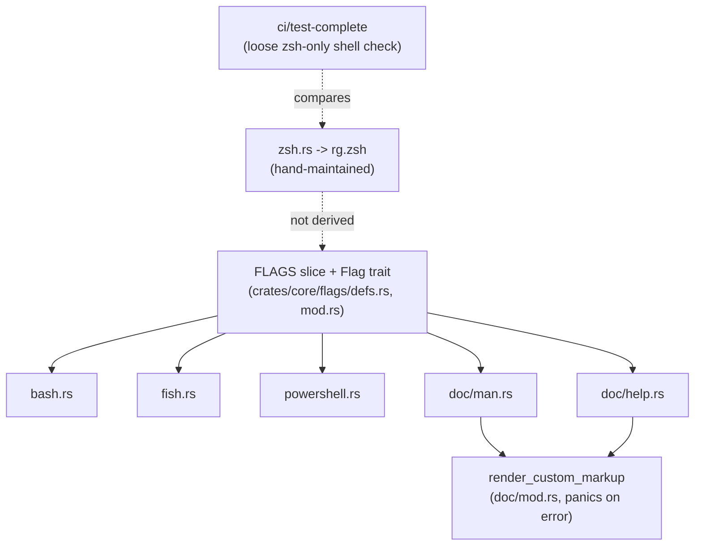
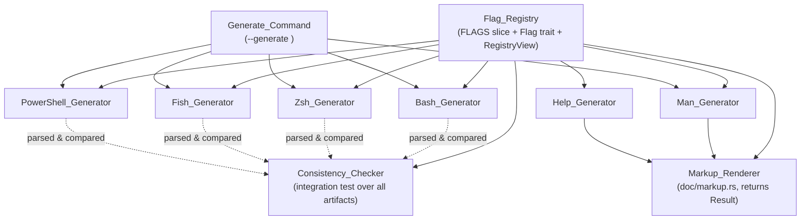

# Design Document

## Overview

ripgrep already derives most of its flag-facing artifacts (Bash, Fish and
PowerShell completions, the `rg.1` man page, and `-h`/`--help` output) from a
shared in-code flag model: the `Flag` trait and the `FLAGS` slice in
`crates/core/flags/`. The notable exception is the Zsh completion
(`crates/core/flags/complete/rg.zsh`), which is hand-maintained and only
loosely guarded by the `ci/test-complete` shell script. That split, plus the
absence of a structured consistency check over the other generated artifacts,
is the root cause of the drift and recurring bugs this feature targets (e.g.
unescaped hyphens in the man page, per-shell divergence in value completion).

This design promotes the existing flag model to a formally documented **single
source of truth** (the `Flag_Registry`), brings the Zsh generator's per-flag
content under that source of truth, centralizes documentation markup rendering
so escaping fixes apply everywhere, and adds an automated `Consistency_Checker`
test that fails the build when any generated artifact diverges from the
registry.

The design deliberately preserves ripgrep's existing architecture and public
behavior:

- It does **not** change ripgrep's search behavior.
- It does **not** change the set of flags ripgrep accepts.
- It keeps the `--generate <mode>` command-line surface and its output
  semantics intact.

The work is therefore a consolidation and hardening of the generation and
validation pipeline rather than a rewrite. The bulk of the new logic is pure:
generators are pure functions from the registry to a string, markup rendering
is a pure string transform, and consistency checking is pure analysis over a
registry and an artifact. This purity is what makes most of the feature
amenable to property-based testing.

### Goals

1. Establish `FLAGS` + the `Flag` trait as the documented, validated single
   source of truth (Requirement 1).
2. Generate the Zsh completion's per-flag content from the registry while
   preserving its expert-authored contextual behavior (Requirement 2).
3. Make value-completion behavior consistent across all four shells
   (Requirement 3) and handle negated names and aliases uniformly
   (Requirement 4).
4. Centralize markup rendering and escaping with real error reporting instead
   of panics (Requirement 5).
5. Add a structured `Consistency_Checker` that reports all violations
   (Requirement 6).
6. Guarantee deterministic, byte-identical generation (Requirement 7).
7. Keep a stable `--generate` command interface (Requirement 8).
8. Keep categories and documentation faithfully reflected in the man page and
   help output (Requirement 9).

### Non-Goals

- Adding, removing, or changing any user-visible flag.
- Changing the shell-specific structure/idioms of completion scripts beyond
  what is needed to source their flag content from the registry.
- Replacing the Zsh script's hand-written contextual logic (flag-compatibility
  grouping). That logic is retained; only the per-flag option content is
  sourced from the registry.

## Architecture

### Current state



### Target state



The two structural changes are:

1. **Zsh per-flag content is generated.** The `rg.zsh` template keeps its
   prelude, helper functions, and flag-compatibility grouping logic, but the
   list of per-flag option specs is produced from the registry and spliced
   into the template (mirroring how `!ENCODINGS!` and `!HYPERLINK_ALIASES!`
   are already spliced in). The hand-maintained per-flag block is removed.
2. **Markup rendering becomes fallible.** `render_custom_markup` is replaced by
   a `Markup_Renderer` that returns `Result` and is shared by all generators
   that embed documentation, so a single escaping/validation fix corrects every
   artifact.

### Module layout

| Concept (requirements)        | Location                                                         | Change |
|-------------------------------|------------------------------------------------------------------|--------|
| `Flag_Registry`               | `crates/core/flags/defs.rs` (`FLAGS`), `mod.rs` (`Flag` trait)   | Add a `RegistryView` accessor + validation entry point |
| `Flag_Definition`             | each `impl Flag for ...` in `defs.rs`                            | Unchanged shape; documented as the canonical record |
| `Bash_Generator`              | `complete/bash.rs`                                                | Minor: route docs through `Markup_Renderer` where applicable |
| `Zsh_Generator`               | `complete/zsh.rs` (+ `rg.zsh` template)                          | Generate per-flag content from registry |
| `Fish_Generator`              | `complete/fish.rs`                                                | Unchanged behavior; covered by checker |
| `PowerShell_Generator`        | `complete/powershell.rs`                                          | Unchanged behavior; covered by checker |
| `Man_Generator`               | `doc/man.rs`                                                      | Use fallible `Markup_Renderer` |
| `Help_Generator`              | `doc/help.rs`                                                     | Use fallible `Markup_Renderer` |
| `Markup_Renderer`             | `doc/markup.rs` (new, replacing `render_custom_markup` in `mod.rs`) | New fallible renderer |
| `Consistency_Checker`         | `crates/core/tests/` (new test module)                          | New |
| `Generate_Command`            | `flags/defs.rs` (`Generate` flag), `main.rs` dispatch            | Unchanged behavior; formalized |

## Components and Interfaces

### Flag_Registry and RegistryView

The registry is the existing `FLAGS: &[&dyn Flag]` slice together with the
`Flag` trait. To support generators and the consistency checker without each
re-implementing iteration and validation, a thin read-only view is introduced.

```rust
/// A validated, read-only view over the canonical flag registry (`FLAGS`).
///
/// Construction performs registry-wide validation (Requirement 1.9, 1.10).
/// All generators and the consistency checker consume this view rather than
/// touching `FLAGS` directly, so validation runs exactly once per generation.
struct RegistryView {
    flags: &'static [&'static dyn Flag],
}

impl RegistryView {
    /// Build the view, validating the registry. Returns an error describing
    /// the first structural problem (duplicate name or missing mandatory
    /// field). Generators must propagate this error and produce no artifact.
    fn load() -> anyhow::Result<RegistryView>;

    /// Iterate flags in registry (declaration) order.
    fn iter(&self) -> impl Iterator<Item = &'static dyn Flag>;

    /// Iterate flags grouped by category, categories in fixed order,
    /// flags within a category in declaration order (Requirement 7.2, 7.3).
    fn by_category(&self) -> impl Iterator<Item = (Category, Vec<&'static dyn Flag>)>;

    /// Resolve a long name (used by the Markup_Renderer). `None` if absent.
    fn lookup_long(&self, name: &str) -> Option<&'static dyn Flag>;
}
```

`Category` already derives `Ord`; the "single fixed order" for categories
(Requirement 7.3) is the enum declaration order, which is what `BTreeMap`
keying already produces today. `by_category` makes that ordering explicit and
shared so every generator emits categories identically.

### Mandatory vs optional fields (Requirement 1.1)

The `Flag` trait already encodes this distinction through required vs
defaulted methods. The design documents the mapping rather than changing it:

| Field (requirement term)     | `Flag` method        | Mandatory? |
|-------------------------------|----------------------|------------|
| long name                     | `name_long`          | Yes (no default) |
| switch-or-value nature        | `is_switch`          | Yes (no default) |
| Completion_Type               | `completion_type`    | Yes (defaults to `Other`, treated as "None") |
| category                      | `doc_category`       | Yes (no default) |
| short documentation           | `doc_short`          | Yes (no default) |
| long documentation            | `doc_long`           | Yes (no default) |
| short name                    | `name_short`         | Optional |
| negated name                  | `name_negated`       | Optional |
| aliases                       | `aliases`            | Optional |
| value variable name           | `doc_variable`       | Optional |
| value choices                 | `doc_choices`        | Optional |

Because mandatory fields are non-defaulted trait methods, "missing mandatory
field" cannot occur at the type level for most fields. `RegistryView::load`
adds the remaining runtime checks that the type system cannot express:

- A non-switch flag must have a `doc_variable` (Requirement 9.5/9.6 pairing),
  and a switch must not (Requirement 9.6).
- Mandatory string fields (`doc_short`, `doc_long`) that are empty where the
  requirement treats them as mandatory are reported, except `doc_short` is
  explicitly allowed to be empty (Requirement 2.5), so only `doc_long` and
  `name_long` emptiness is treated as a missing-field error.

When a mandatory field is missing, `load` returns an error naming the affected
flag (by long name, or by debug identity if the long name itself is the
problem) and the missing field; no artifact is produced (Requirement 1.10).

### Completion_Type mapping (Requirement 3)

`CompletionType` gains an explicit `None` semantics (today represented by
`Other` with no choices / switch). The mapping each generator must honor:

| Completion_Type | Bash | Zsh | Fish | PowerShell |
|-----------------|------|-----|------|------------|
| Filename   | `compgen -f` | `_files` | `-r -F` | file/path completion |
| Executable | command completion | `_command_names` | `-r -f -a '(__fish_complete_command)'` | command completion |
| Filetype   | `rg --type-list` choices | type list | `rg --type-list` | type list |
| Encoding   | encodings list | encodings list | encodings list | encodings list |
| Choices    | `compgen -W choices` | choices in declared order | `-a 'choices'` | choices |
| None/switch | no value | no value | no value (`-f`, switch requests none) | no value |

The crucial invariants (validated by the consistency checker and properties):
choices are offered **in declared order** and **exactly** the declared set
(Requirement 3.3); a Fish switch requests no value (Requirement 3.6).

### Zsh_Generator (Requirement 2)

The Zsh generator changes from "emit a hand-written script verbatim" to
"splice generated per-flag specs into a hand-written scaffold". The `rg.zsh`
template retains:

- its prelude, helper functions, and documentation;
- its flag-compatibility grouping logic (the contextual behavior referenced by
  Requirement 2.6);
- the existing `!ENCODINGS!` and `!HYPERLINK_ALIASES!` splice points.

A new `!FLAGS!` splice point receives one `_arguments`-style spec per
`Flag_Definition`, generated from the registry:

- one entry per flag including the long name (Requirement 2.1);
- the short name as a separately completable option where present
  (Requirement 2.2);
- the negated name as a separately completable option where present
  (Requirement 2.3);
- description text taken character-for-character from `doc_short`
  (Requirement 2.4), including the empty-description case (Requirement 2.5);
- value completion derived from `completion_type`/`doc_choices` using the
  mapping above (Requirement 3), with names/description/choices left
  byte-identical to the registry even when contextual grouping is applied
  (Requirement 2.6).

The grouping logic operates on flag *names* (which flags are mutually
exclusive) and never rewrites description text or choices, so it composes with
generated content without violating Requirement 2.6.

### Markup_Renderer (Requirement 5)

`render_custom_markup` in `doc/mod.rs` is replaced by a dedicated, fallible
renderer in `doc/markup.rs`. The current implementation panics
(`unreachable!`) on unresolved or malformed tags; the new one returns a
`Result` so generation halts cleanly with a diagnostic and no artifact.

```rust
/// Errors produced while resolving documentation markup.
enum MarkupError {
    /// `\flag{name}` or `\flag-negate{name}` referenced an unknown name.
    UnknownFlag { tag: String, name: String },
    /// `\flag-negate{name}` referenced a flag with no negation.
    NoNegation { tag: String, name: String },
    /// A `\...{...}` tag was not recognized or was malformed (e.g. unclosed).
    Malformed { tag: String },
}

/// Resolve all supported markup tags in `doc` against `registry`, targeting
/// the given output flavor (roff for man, plain for help).
fn render_markup(
    doc: &str,
    registry: &RegistryView,
    flavor: MarkupFlavor,
) -> Result<String, MarkupError>;

enum MarkupFlavor { Roff, Plain }
```

Behavior:

- `\flag{name}` -> cross-reference containing the resolved long name
  (Requirement 5.1).
- `\flag-negate{name}` -> cross-reference containing the resolved negated name
  (Requirement 5.2).
- unknown `name` -> `UnknownFlag` error; no artifact (Requirement 5.3).
- `\flag-negate{name}` where the flag has no negation -> `NoNegation` error; no
  artifact (Requirement 5.4).
- unrecognized/malformed tag -> `Malformed` error; no artifact
  (Requirement 5.5).
- **Hyphen escaping** for roff flavor is performed centrally here when emitting
  a flag name, so every hyphen in an emitted flag name becomes `\-` exactly
  once (Requirement 5.6). This is the single place the historical man-page
  hyphen bug is fixed.

Centralizing escaping means the man and help generators no longer each carry
their own `.replace("-", r"\-")` logic; they call the renderer with the
appropriate `MarkupFlavor`.

### Consistency_Checker (Requirement 6)

A new integration test (in `crates/core/tests/`) builds each completion
artifact via its generator, extracts the flag names and per-flag description
text it references, and compares against the registry. It is a test rather than
a runtime command because it guards releases (it runs in CI), and it can use
representative parsing of each shell's output format.

```rust
/// One discrepancy between an artifact and the registry.
struct Violation {
    artifact: ArtifactId,          // Bash | Zsh | Fish | PowerShell
    kind: ViolationKind,
}

enum ViolationKind {
    MissingFlag { name: String },                 // in registry, not in artifact (6.1)
    UnexpectedLongFlag { name: String },          // long name in artifact, not in registry (6.2)
    UnexpectedShortAlias { name: String },        // short alias in artifact, not in registry (6.3)
    DescriptionMismatch { flag: String, expected: String, actual: String }, // (6.4)
}

/// Check every completion artifact against the registry, collecting all
/// violations (Requirement 6.5). Empty result == success (Requirement 6.6).
fn check_all(registry: &RegistryView) -> Vec<Violation>;
```

Key design points:

- The checker collects **all** violations across all artifacts in a single run
  and reports every one (Requirement 6.5), rather than failing on the first.
- A successful run (every flag present in every artifact with matching long
  names, matching short aliases, and byte-identical descriptions, and no
  unexpected names) yields an empty `Vec<Violation>` and a passing test
  (Requirement 6.6).
- Description comparison is exact, including case and interior whitespace
  (Requirement 6.4).
- Each shell needs a small, format-specific extractor (e.g. parse `-l`/`-s`/
  `-d` from Fish lines, `[CompletionResult]::new(...)` from PowerShell, the
  `_arguments` specs from Zsh, the opts list from Bash). These extractors are
  the only shell-format-aware code in the checker.

### Generate_Command (Requirement 8)

The existing `--generate <mode>` flow is retained as-is and formalized:

- `Generate` flag (`defs.rs`) maps the mode string to `GenerateMode`.
- `main.rs` dispatches `GenerateMode` to the matching generator and writes the
  artifact, and only the artifact, to stdout (Requirements 8.1-8.5).
- Unrecognized mode -> error to stderr, nothing to stdout, non-zero exit
  (Requirement 8.6); the existing `bail!("choice '{unk}' is unrecognized")`
  path covers this.
- Missing mode argument -> error to stderr indicating a mode is required,
  nothing to stdout, non-zero exit (Requirement 8.8).
- Successful generation -> zero exit (Requirement 8.7).

With the new fallible registry/markup pipeline, a generator can now fail
(invalid registry, bad markup). On failure the command writes the diagnostic
to stderr, writes nothing to stdout, and exits non-zero — consistent with the
unrecognized-mode behavior.

## Data Models

### Flag_Definition (the `Flag` trait record)

```rust
trait Flag {
    fn is_switch(&self) -> bool;                       // switch-or-value nature
    fn name_short(&self) -> Option<u8> { None }        // optional short name
    fn name_long(&self) -> &'static str;               // mandatory long name
    fn aliases(&self) -> &'static [&'static str] { &[] }      // optional aliases
    fn name_negated(&self) -> Option<&'static str> { None }   // optional negation
    fn doc_variable(&self) -> Option<&'static str> { None }   // optional value var name
    fn doc_category(&self) -> Category;                // mandatory category
    fn doc_short(&self) -> &'static str;               // mandatory short doc (may be empty)
    fn doc_long(&self) -> &'static str;                // mandatory long doc
    fn doc_choices(&self) -> &'static [&'static str] { &[] }  // optional value choices
    fn completion_type(&self) -> CompletionType { CompletionType::Other } // completion type
    fn update(&self, value: FlagValue, args: &mut LowArgs) -> anyhow::Result<()>;
}
```

### CompletionType

```rust
enum CompletionType {
    Other,       // "None": switch, or value with optional inline choices
    Filename,
    Executable,
    Filetype,
    Encoding,
}
```

(The requirements' `Choices` type is represented by `Other` + a non-empty
`doc_choices()`; `None` is represented by `Other` with no choices / a switch.
This preserves the existing enum while satisfying Requirement 3's six
classifications.)

### Category (fixed ordering source)

```rust
enum Category { Input, Search, Filter, Output, OutputModes, Logging, OtherBehaviors }
```

Declaration order defines the fixed category ordering used by every generator
(Requirement 7.3).

### Validation outcomes

```rust
enum RegistryError {
    DuplicateLong   { name: String },                 // Requirement 1.9
    DuplicateShort  { name: char },                   // Requirement 1.9
    DuplicateNegated{ name: String },                 // Requirement 1.9
    MissingField    { flag: String, field: &'static str }, // Requirement 1.10
}
```

### GenerateMode (command surface)

```rust
enum GenerateMode { Man, CompleteBash, CompleteZsh, CompleteFish, CompletePowerShell }
```

## Correctness Properties

*A property is a characteristic or behavior that should hold true across all
valid executions of a system — essentially, a formal statement about what the
system should do. Properties serve as the bridge between human-readable
specifications and machine-verifiable correctness guarantees.*

These properties are derived from the acceptance criteria via the prework
analysis. Generators, the markup renderer, the registry validator, and the
consistency checker are all pure functions over a registry view, which makes
them well suited to property-based testing. To exercise them across many
inputs, the property tests construct **synthetic registries** (collections of
generated `Flag_Definition`s) and run the real generation/validation/checking
logic against them. The properties below were consolidated during reflection to
remove redundancy (e.g. per-shell completion-type criteria combined into one
parameterized property; Zsh-only negation completion subsumed by the
all-shells property).

### Property 1: Single edit propagates to every artifact

*For any* registry and any single edit to it (adding or removing one
`Flag_Definition`), regenerating each artifact yields a referenced-flag set
that reflects exactly that edit, with no change to any generator's code.

**Validates: Requirements 1.8**

### Property 2: Duplicate names fail validation

*For any* registry containing two or more `Flag_Definition`s that share a long
name, or share a short name, or share a negated name, registry validation fails
with an error identifying the conflicting field and value, and no artifact is
produced.

**Validates: Requirements 1.9**

### Property 3: Missing mandatory field halts generation

*For any* registry in which a `Flag_Definition` is missing a runtime-checkable
mandatory field, each generator halts without producing its artifact and
returns an error identifying the affected `Flag_Definition` and the missing
field.

**Validates: Requirements 1.10**

### Property 4: Zsh produces one faithful entry per flag

*For any* registry, the Zsh artifact contains exactly one completion entry per
`Flag_Definition` that includes the long name; includes the short name as a
separately completable option for every flag that has one; and uses a
description that is character-for-character identical to that flag's short
documentation (including the empty-description case).

**Validates: Requirements 2.1, 2.2, 2.4, 2.5, 2.6**

### Property 5: Completion-type maps to the right construct in every shell

*For any* registry and for each of the Bash, Zsh, Fish, and PowerShell
artifacts, every flag whose Completion_Type is Filename, Executable, Filetype,
or Encoding has a completion entry that completes its value using that shell's
corresponding native construct (file path, command, ripgrep file type, or
supported encoding respectively).

**Validates: Requirements 3.1, 3.2, 3.4, 3.5**

### Property 6: Declared choices are offered exactly and in order

*For any* registry and for each of the four shell artifacts, a flag that
declares value choices has a completion entry that offers exactly those
choices and no others, in the order they are declared in the registry.

**Validates: Requirements 3.3**

### Property 7: Fish requests no value for switches

*For any* registry, every switch `Flag_Definition` has a Fish completion entry
that requests no value.

**Validates: Requirements 3.6**

### Property 8: Negated names are completable in every shell

*For any* registry and for each of the four shell artifacts, every
`Flag_Definition` that has a negated name has a completion entry offering that
negated name as a completable flag.

**Validates: Requirements 2.3, 4.1**

### Property 9: Aliases are completable in every shell

*For any* registry and for each of the four shell artifacts, every alias of
every `Flag_Definition` is offered as a completable flag.

**Validates: Requirements 4.2**

### Property 10: Negation is documented for switches in man and long help

*For any* registry, every switch `Flag_Definition` that has a negated name has
man-page documentation and long-help documentation that states the flag can be
disabled, showing the negated name verbatim.

**Validates: Requirements 4.3, 4.4**

### Property 11: Markup resolves flag and negation cross-references

*For any* registry and any `Flag_Definition` X in it, rendering a documentation
string containing `\flag{X}` produces output containing X's long name; and for
any X that has a negated name, rendering `\flag-negate{X}` produces output
containing X's negated name.

**Validates: Requirements 5.1, 5.2**

### Property 12: Markup referencing an unknown name errors

*For any* name absent from the registry, rendering a documentation string
containing `\flag{name}` or `\flag-negate{name}` returns an error identifying
the unresolved name and the offending tag, and no artifact is produced.

**Validates: Requirements 5.3**

### Property 13: Negation markup on a non-negatable flag errors

*For any* `Flag_Definition` that has no negated name, rendering a documentation
string containing `\flag-negate{that flag}` returns an error identifying the
flag and the offending tag, and no artifact is produced.

**Validates: Requirements 5.4**

### Property 14: Malformed markup errors

*For any* documentation string containing an unrecognized or malformed markup
tag (such as an unclosed brace or an unknown tag name), rendering returns an
error identifying the offending tag, and no artifact is produced.

**Validates: Requirements 5.5**

### Property 15: Hyphens in flag names are escaped in roff

*For any* `Flag_Definition` whose name contains hyphens, the man generator's
roff emission of that name escapes every hyphen so the rendered man page
displays a literal hyphen for each.

**Validates: Requirements 5.6**

### Property 16: Checker detects missing flags

*For any* registry and any completion artifact from which one or more flags are
absent, the consistency checker terminates with a failure result that
identifies, for each such case, the missing flag name and the affected
artifact.

**Validates: Requirements 6.1**

### Property 17: Checker detects unexpected names

*For any* completion artifact that references a long flag name or a short flag
alias absent from the registry, the consistency checker terminates with a
failure result identifying the unexpected name and the affected artifact.

**Validates: Requirements 6.2, 6.3**

### Property 18: Checker detects description mismatches

*For any* completion artifact in which a flag's description text is not
character-for-character identical (including case and interior whitespace) to
the corresponding flag's short documentation, the consistency checker
terminates with a failure result identifying the mismatched flag, the affected
artifact, and both the expected and actual text.

**Validates: Requirements 6.4**

### Property 19: Checker reports all violations in one run

*For any* set of injected violations across one or more artifacts, a single
run of the consistency checker reports every injected violation rather than
only the first.

**Validates: Requirements 6.5**

### Property 20: Faithful artifacts pass the checker

*For any* registry, running the consistency checker against the artifacts
actually produced by the generators yields a success result with no
violations.

**Validates: Requirements 6.6**

### Property 21: Generation is deterministic

*For any* registry and any generator, invoking that generator two or more times
against the unchanged registry produces byte-identical artifacts, containing no
content that varies between invocations.

**Validates: Requirements 7.1, 7.4**

### Property 22: Flags and categories are emitted in fixed order

*For any* registry and for each generator, the categories are emitted in the
fixed declaration order, and within each category the flags are emitted in the
exact order their `Flag_Definition`s appear in the registry.

**Validates: Requirements 7.2, 7.3**

### Property 23: Each flag appears under exactly one matching category heading

*For any* registry, both the man page and the help output place each
`Flag_Definition` under exactly one category heading that matches the category
assigned to that flag.

**Validates: Requirements 9.1, 9.2**

### Property 24: Help renders every flag's documentation with markup resolved

*For any* registry, the short help contains each flag's markup-resolved short
documentation and the long help contains each flag's markup-resolved long
documentation.

**Validates: Requirements 9.3, 9.4**

### Property 25: Man shows value variables only for value flags

*For any* registry, the man page displays the value variable name immediately
following the flag name for every non-switch flag that has one, and displays no
value variable name for any switch flag.

**Validates: Requirements 9.5, 9.6**

## Error Handling

The pipeline shifts from "panic on inconsistency" to "return a diagnostic and
produce no artifact". The error surfaces:

| Stage | Error | Cause (requirement) | Behavior |
|-------|-------|---------------------|----------|
| `RegistryView::load` | `RegistryError::DuplicateLong/Short/Negated` | conflicting names (1.9) | Return error naming field + value; no artifact |
| `RegistryView::load` | `RegistryError::MissingField` | missing mandatory field (1.10) | Return error naming flag + field; no artifact |
| `Markup_Renderer` | `MarkupError::UnknownFlag` | tag references unknown name (5.3) | Return error naming name + tag; no artifact |
| `Markup_Renderer` | `MarkupError::NoNegation` | `\flag-negate` on non-negatable flag (5.4) | Return error naming flag + tag; no artifact |
| `Markup_Renderer` | `MarkupError::Malformed` | unrecognized/malformed tag (5.5) | Return error naming tag; no artifact |
| `Generate_Command` | unrecognized mode | bad `--generate` mode (8.6) | stderr message, empty stdout, non-zero exit |
| `Generate_Command` | missing mode | no `--generate` argument (8.8) | stderr message, empty stdout, non-zero exit |
| `Generate_Command` | propagated generation error | any of the above during generation | stderr message, empty stdout, non-zero exit |

Principles:

- **Fail closed, fail whole.** When any generation-time error occurs, no
  partial artifact is written. This protects against half-generated completion
  scripts being committed.
- **Error messages are actionable.** Each error names the specific flag, field,
  name, or tag at fault, so a maintainer can fix the registry without reading
  generator code.
- **`anyhow::Result` is the propagation type.** Generators return
  `anyhow::Result<String>`; `main.rs` maps an `Err` to a stderr write and a
  non-zero exit, reusing the existing `--generate` error path.
- **The consistency checker accumulates rather than short-circuits.** It
  gathers every violation across every artifact before reporting
  (Requirement 6.5), so one CI run surfaces all drift at once.

## Testing Strategy

### Dual approach

- **Unit / example tests** cover the command-interface scenarios and concrete
  edge cases that do not vary meaningfully with input.
- **Property tests** cover the universal behaviors of the pure generation,
  validation, markup, and checking logic.
- **The consistency checker** itself is an integration test that runs in CI and
  replaces the loose `ci/test-complete` zsh-only script as the authoritative
  drift guard.

### Property-based testing

PBT is appropriate here because the generators, registry validator, markup
renderer, and consistency checker are pure functions whose behavior varies
meaningfully across the space of possible registries and documentation strings.

- **Library:** use `proptest` (the established property-testing crate in the
  Rust ecosystem). Do not hand-roll a property framework.
- **Generators (test data):** a `proptest` strategy builds synthetic
  registries — vectors of generated `Flag_Definition`s with varied long names,
  optional short names, optional negations, alias lists, categories, switch vs
  value nature, completion types, choice lists, and short/long docs (including
  empty `doc_short` and hyphen-rich names). Variants of this strategy inject
  duplicates (Property 2), invalidate a mandatory field (Property 3), or
  perturb a generated artifact (Properties 16–19) to drive the negative
  properties.
- **Test seam:** generators and the checker must accept a `RegistryView`
  (rather than reading the global `FLAGS` directly) so tests can supply
  synthetic registries. Production call sites pass the real registry.
- **Iterations:** configure each property test for a minimum of 100 cases.
- **Tagging:** annotate each property test with a comment referencing its
  design property, in the format:
  `// Feature: unified-flag-source, Property {number}: {property_text}`
- **One test per property:** each of Properties 1–25 is implemented by a single
  property-based test.

### Example and integration tests

- **`--generate` command (Requirements 8.1–8.8):** example tests invoking the
  command for each recognized mode (assert stdout equals the generator output
  and exit code is zero), for an unrecognized mode (assert stderr message,
  empty stdout, non-zero exit), and for a missing mode (same).
- **Edge cases:** an explicit test for empty `doc_short` producing an empty
  description (Requirement 2.5, complementing Property 4); roff hyphen escaping
  on a representative real flag (complementing Property 15).
- **End-to-end drift guard:** the consistency checker runs against the real
  `FLAGS` registry and the real generated artifacts in CI (Property 20 applied
  to production data).

### Migration verification

Because this feature must not change existing behavior for already-generated
artifacts, the Bash, Fish, PowerShell, man, and help outputs are snapshot-
compared before and after the refactor to confirm byte-stability. The Zsh
output is expected to change (its per-flag content is now generated); its new
output is validated by the consistency checker and the Zsh properties rather
than by a pre-refactor snapshot.
